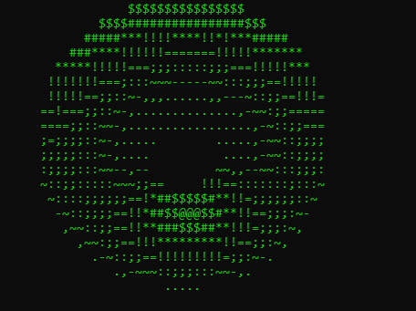

# Terminal Torus

**A real-time, rotating 3D ASCII doughnut rendered entirely in your terminal.**  
Written in Python. Pure character-based sorcery.


---

## Features

- **3D ASCII animation** using pure Python math
- **No dependencies** – runs out of the box
- **Cyberpunk green aesthetic** for extra hacker points
- Minimal CPU usage, maximum terminal swagger

---

## Preview

Here’s a taste of the torus in motion:

> **Note:** This GIF is just a glimpse—run the code for full hypnotic effect.

*(terminal recording GIF or screenshot here once ready for me to remember )*

---

## Installation & Usage

1. Clone the repo:
   ```bash
   git clone https://github.com/pyrixix/Terminal-Torus.git
   cd Terminal-Torus
   ```

2. Run the Python script:
   ```bash
   python doughnut.py
   ```

> **Press `Ctrl + C`** to exit the animation loop.

---

## Screenshot



---

## How It Works

This script is based on the brilliant 3D torus projection technique by Shivangi Jha. It simulates a rotating doughnut by:
- Calculating XYZ coordinates on a torus
- Applying 3D-to-2D perspective projection
- Using depth buffers for realistic occlusion
- Mapping brightness levels to ASCII characters

The result? A hypnotic, rotating green torus... in your terminal.

---

## Credits

- Original math, rendering and color tweaks by Shivangi Jha (https://github.com/pyrixix)


---

*Because sometimes, a spinning ASCII doughnut is all the clarity you need.*
